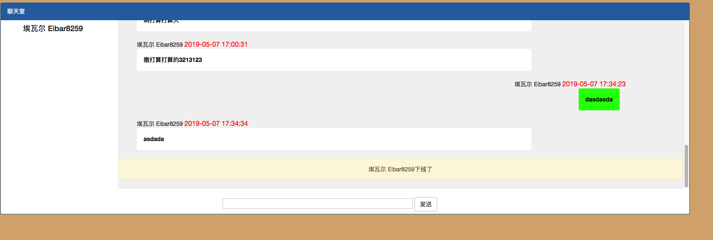

# 超low聊天室
## 前提
* php-5.3.10 或更高版本
* gcc-4.4 或更高版本
* swoole 通过PHP官方提供的pecl命令，一键下载安装swoole `pecl install swoole`
* redis 安装phpredis扩展
## 如何使用
运行[websocket.php](websocket.php),然后打开[chat.html](chat.html)就可以了

### 效果图

